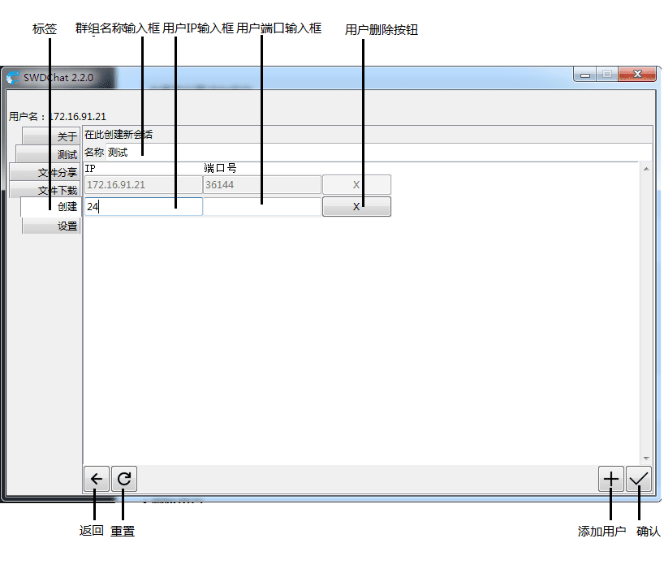

# SWDChat 2.2.0 用户文档

欢迎您选择使用SWDChat!
这里是SWDChat 2.2.0 用户文档

---
# 绪言
SWDChat是一个去中心化信息传输交流工具，开发之初衷为提供一种无需服务器和复杂配置即可实现的局域网内交流协作的方式，并利用局域网的带宽和时延优势。
同时，考虑到安全性，SWDChat使用TLS加密TCP连接，在两个客户端之间提供保密性、数据完整性以及真实性。
SWDChat以“精简，但更精妙”的目标设计和编写，阅读下面的内容以了解使用方式。

## 特性介绍


1. 完全的去中心化，系统搭建随时随地
2. TLS加密，保证安全
3. 简洁而易于上手的UI
4. 轻量级的软件设计——但功能齐全！

---
## 快速上手

### 1. 启动应用

#### Python 源代码版：

推荐Python版本>=3.8.6 (不支持no GIL edition)
    
##### Windows Powershell
```
pip install -r requirements.txt
py swdchat.py
```

#### 预编译二进制文件版：

    双击打开SWDChat.exe

### 2. 创建第一个会话

##### 1. 选择创建选项卡
    在左侧边栏中选择"创建"选项卡

##### 2. 输入你要创建的会话的名称
    例如"测试"
##### 3. 添加用户
    如果我们要添加用户
    1. 点击右下角"添加用户"按钮
    2. 需要填写用户的IP地址和端口号
        IP和端口填写规则：
       1. IP填写可以省略前部相同的IP段
       2. PORT(端口号)需完整填写，当然，当目标端口号相同时也可以留空
    他的IP地址为172.16.91.24(我的IP地址为172.16.91.23)
    那么，示例中的IP填写方式都是合法的
示例
```
IP              PORT
24              36144
24              (留空)
91.24
16.91.24        36144
16.91.24
172.16.91.24
```
错误示例(开头不能加.)
```
IP              PORT
.24             36144
.91.24
.16.91.24
```
##### 4.删除用户
    点击用户右侧的'X'按钮
    或点击左下角"重置"按钮以清空所有输入
##### 5.点击"确定"按钮(不能忘记！)

### 3. 发送消息


   1. 标题栏
   2. 添加图片按钮
   3. 添加文件按钮
   4. 语音输入按钮
   5. 输入框
   6. 会话设置按钮
   7. 用户发送的消息
   8. 系统提示消息
   9. 发送按钮
   
##### 1. 发送文字
    在输入框中输入消息内容，点击"发送"按钮或按Enter键发送
##### 2. 发送图片
    点击"发送图片"按钮以选择并发送图片
    注意：当你发送的图片看起来清晰度不够，可以**单击以放大**
##### 3.发送文件
    点击"发送文件"按钮以选择并发送文件

##### 4.语音输入
Baidu_aip的配置
SWDChat使用百度智能云提供的语音识别服务实现语音输入功能，为使用相关服务，请按下列说明填写baiduaip.json。
请先登陆百度智能云控制台,创建语音识别应用，当您成功创建应用后，在语音识别产品页签下选择“应用列表”，查看已创建的应用。
请复制平台分配给您此应用的相关凭证，主要为AppID、API Key、Secret Key，这将用于填写baiduaip.json。
在SWDChat安装目录下创建baiduaip.json，并输入以下内容：
```
{"BaiduAPP_ID": "您的应用的APP_ID", "BaiduAPI_KEY": "您的应用的API_KEY", "SECRET_KEY": "您的应用的SECRET_KEY "}
```
重启SWDChat后即可使用语音输入功能。

使用：
点击主按钮开始/结束语音输入，删除按钮清楚内容，点击“√“插入到当前标签页


### 4.编辑群组
##### 1.点击"修改群组"按钮以修改群组
##### 2.修改用户
参考[创建第一个会话](#2-输入你要创建的会话的名称)

### 5.设置
设置页面可以查看自己的IP和端口,并设置自己的用户名和下载文件的保存地址


点击程序界面左侧的“设置”选项卡，即可查看及修改软件设置。
该选项卡共有以下内容：
1. 当前客户端IP地址及端口号，这将用于创建及修改群组。
2. 设置用户名：向您和其他用户显示的名字，同时也会显示在窗口左上角。
3. 默认下载路径：点击右侧的按钮以修改路径，您下载的文件将会位于该目录中。若下载路径为空，则下载到SWDChat安装目录中
4. 点击窗口右上角“X”按钮时的操作：若选择“最小化到托盘区”，您仍然可以收到消息，并可以通过点击托盘区的SWDChat图标打开SWDChat窗口。
5. 保存设置：只有点击此按钮，修改的设置项才会被应用。
6. 退出：退出SWDChat。

**如果不点击"保存"就不会生效**

---
### 6.文件分享及下载
SWDChat不仅提供群组内文件发送功能，而且您可以通过文件分享功能传输文件。
该功能不仅可用于SWDChat2.2.0，同时也兼容SWDChat1.X系列，并且支持使用浏览器下载，因此，即使对方电脑上未安装SWDChat，也可以接收文件。
#### 创建及管理文件分享：
1. 点击“文件分享”选项卡，选择文件并设置分享代码，点击“√“创建一个文件分享。
2. 对于一个已有的分享，点击垃圾桶图标可以删除（此操作不影响磁盘上的文件）。
#### 下载他人分享的文件：
##### 通过SWDChat2.2.0下载：
点击“文件下载“选项卡，输入对方IP地址（若前缀与本机IP相同可省略，具体可以参考创建群组部分）和端口号（与当前SWDChat客户端相同可省略，具体可以参考 [参见新增用户](#3-添加用户)）以及分享代码。点击“＋”创建任务，但不会立即下载；点击下载图标会创建任务并立即开始下载。
##### 通过SWDChat1.X下载：
请参考SWDChat1.X有关文档。
##### 通过浏览器下载：
在浏览器中访问``https://对方IP:对方端口号/s/分享代码``，如果出现证书错误，可以点击“高级“-”继续访问（不安全）“（以Microsoft Edge为例，其他浏览器类似）以下载文件。


---

# 结语
SWDChat一直秉承“创新、实用、高效”的原则，积极以用户思维设计界面和功能，倾听使用者的声音。
软件使我们的生活更美好，我们携手并进，让软件更好，生活更美好！
我们欢迎建议，请访问[我们的主页](https://github.com/SWD-Studio/swdchat/issues)协助我们继续优化SWDChat！
