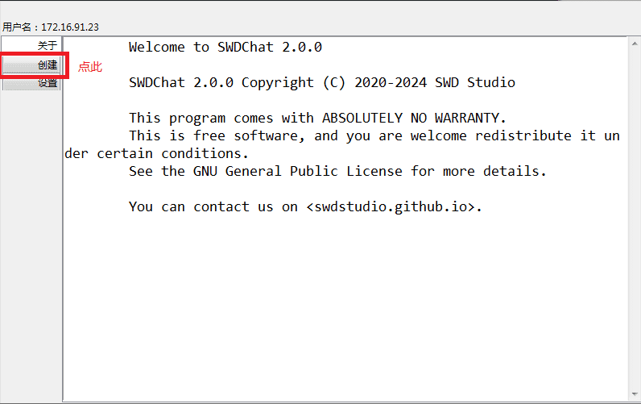
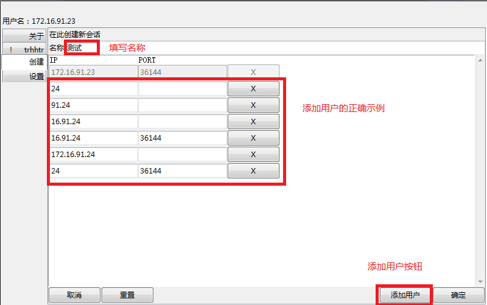
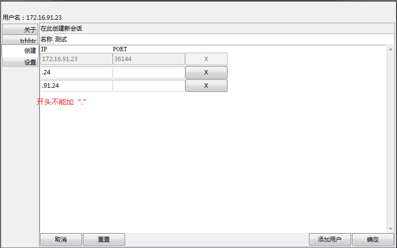
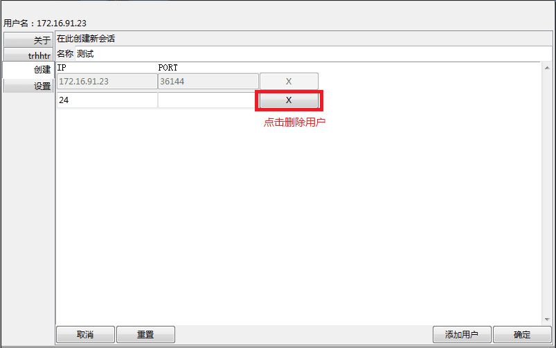
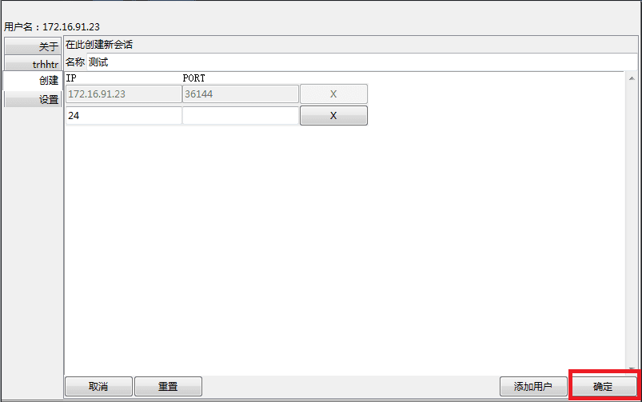
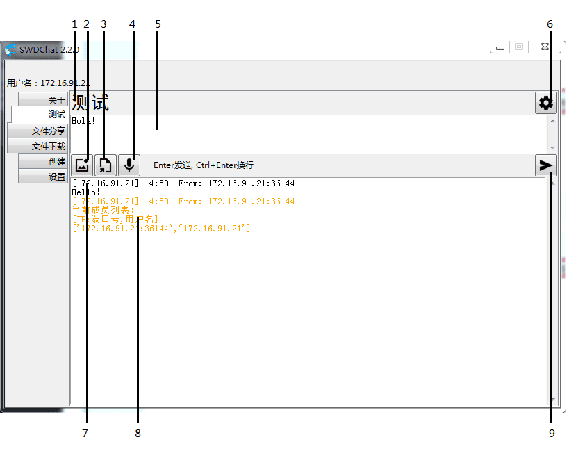
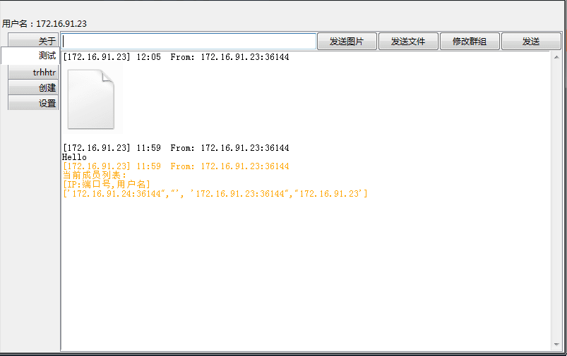
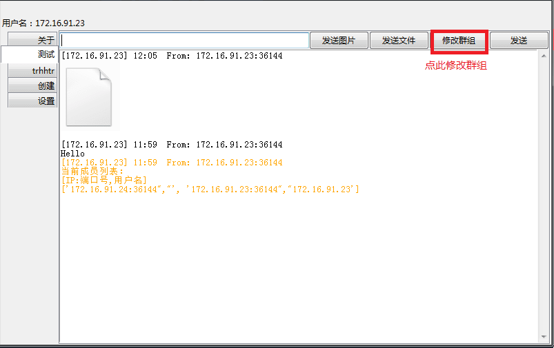
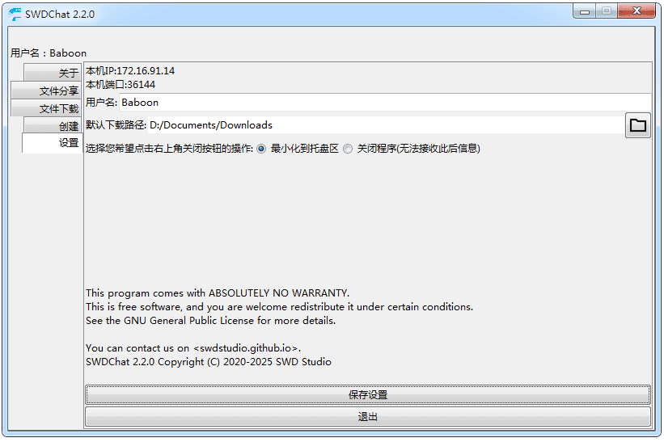

# SWDChat 2.0.0 用户文档

欢迎您选择使用SWDChat!
这里是SWDChat 2.0.0 用户文档

---
## 特性介绍

1. 完全的去中心化，系统搭建随时随地
2. TLS加密，保证安全
3. 简洁而易于上手的UI
4. 轻量级的软件设计——但功能齐全！

---
## 快速上手

### 1. 启动应用

#### Python 源代码版：

    使用Python启动器(Python launcher)打开swdchat.py
    推荐Python版本>=3.8.6,<3.13.0

#### 预编译二进制文件版：

    双击打开SWDChat.exe

### 2. 创建第一个会话

##### 1. 
    在左侧边栏中选择"创建"选项卡

##### 2. 输入你要创建的会话的名称
    例如"测试"
##### 3. 添加用户
    如果我们要添加用户
    1. 点击右下角"添加用户"按钮
    2. 需要填写用户的IP地址和端口号
        IP和端口填写规则：
       1. IP填写可以省略前部相同的IP段
       2. PORT(端口号)需完整填写，当然，当目标端口号相同时也可以留空
    他的IP地址为172.16.91.24(我的IP地址为172.16.91.23)
    那么，示例中的IP填写方式都是合法的

    错误示例

##### 4.删除用户
    点击用户右侧的'X'按钮

    或点击左下角"重置"按钮以清空所有输入
##### 4.点击"确定"按钮

### 3. 发送消息

##### 1. 发送文字
    在输入框中输入消息内容，点击"发送"按钮或按Enter键发送

##### 2. 发送图片
    点击"发送图片"按钮以选择并发送图片
    注意：目前只支持.PNG格式图片
    效果示例：

    注意：当你发送的图片看起来清晰度不够，可以**单击以放大**
##### 3.发送文件
    点击"发送文件"按钮以选择并发送文件

### 4.编辑群组
##### 1.点击"修改群组"按钮以修改群组

##### 2.修改用户
    参考2. 创建第一个会话

### 5.设置
设置页面可以查看自己的IP和端口,并设置自己的用户名和下载文件的保存地址

**要记得点"保存"哦(不然不会生效)**

---
### 6.文件分享
点击按钮选择文件并输入分享代码，按确认即可分享
下载时，输入目标IP和端口 *参见新增用户* 和分析代码即可加入下载队列，点击下载按钮即可下载

### 7.其他问题
如果你遇到了其他问题，请[在这里汇报给我们](https://github.com/SWD-Studio/swdchat/issues)
---