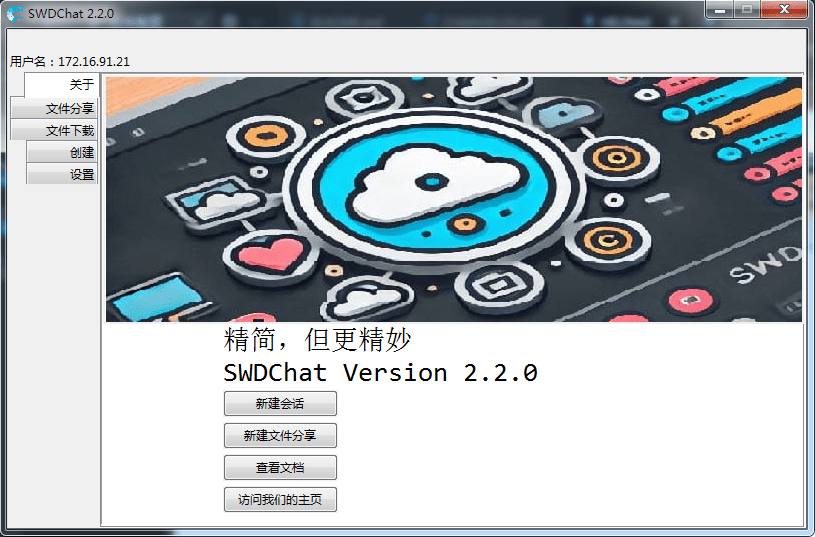

# SWD Chat
####  这是 2025年萧山区学生信息素养提升实践活动 中SWDChat项目的代码仓库 


## 一个免费，自由，开源的局域网去中心化信息传输交流工具


## 跳转至[用户文档](./HELP.html)

## 特点

1. 完全的去中心化
2. 简洁而易于上手的UI
3. 轻量级的软件设计——但功能齐全！

## 运行
配置环境并运行
##### Windows Powershell
```
pip install -r requirements.txt
py swdchat.py
```
## 问题

raise an issue or send an email to <swd_studio@outlook.com>
## 系统要求：
OS：Microsoft Windows 7 SP1 or above

Python: Cpython >=3.8 (free-thread edition not support)

硬盘：50MB及以上空闲空间

## 开发环境：
系统：Windows 7 SP1

Python解释器：CPython 3.8.6rc1 for Windows(x64)

## 鸣谢

本软件利用[Python](https://www.python.org)语言编写

本软件的二进制预编译文件利用[pyinstaller](https://pyinstaller.org/)制作

感谢郑京飞老师、王嘉宏教练提供的指导

感谢[天坑](https://github.com/tianhangj)老师提供的建设性意见

详见[第三方引用声明](./ThirdPartyNotices.md)
### See [Change Log](./CHANGELOG.md)
