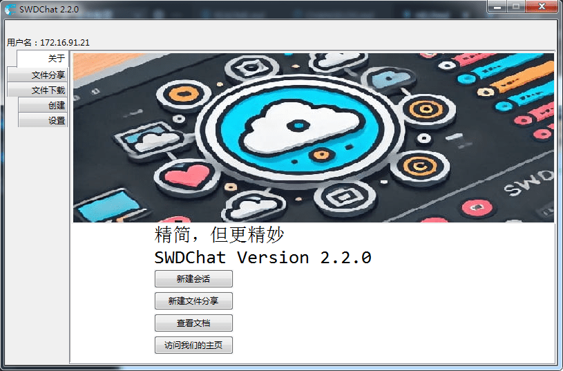

# SWD Chat


## 一个免费，自由，开源的局域网去中心化信息传输交流工具


## 转到[用户文档](./HELP.md)

## 特点

1. 完全的去中心化
2. 简洁而易于上手的UI
3. 轻量级的软件设计——但功能齐全！

## 运行源码版本
配置环境并运行
##### Windows Powershell
```
pip install -r requirements.txt
py swdchat.py
```
## 发现一个问题？

提交一个issue或发邮件到 <swd_studio@outlook.com>
## 系统要求：
操作系统：Windows 7 SP1 或更高

Python: CPython >=3.8 (不支持自由线程的Python构建)

硬盘：50MB及以上空闲空间

## 开发环境：
系统：Windows 11 25H2

Python解释器：CPython 3.13.11 for Windows(x64)

## 鸣谢

本软件采用[Python](https://www.python.org)语言编写

本软件的二进制预编译文件使用[pyinstaller](https://pyinstaller.org/)制作

感谢[天坑](https://github.com/tianhangj)老师提供的建设性意见

详见[第三方引用声明](./ThirdPartyNotices.md)
### See [Change Log](./CHANGELOG.md)

